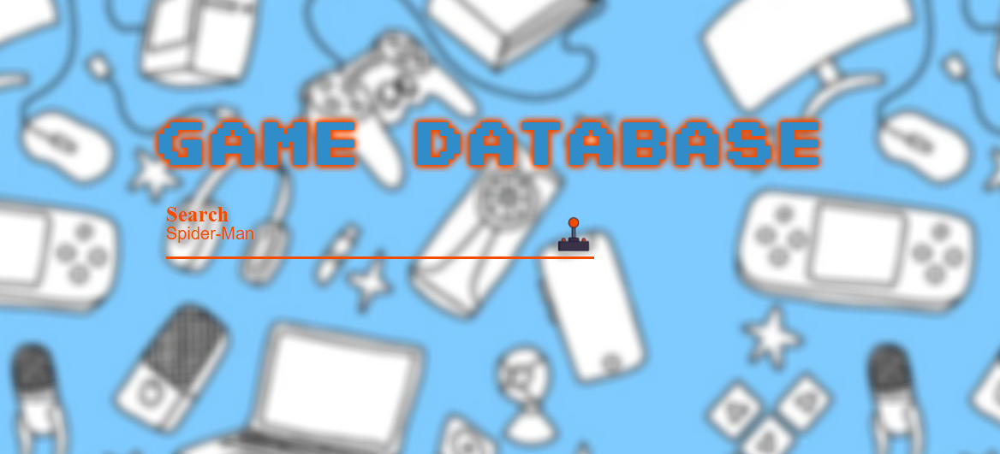
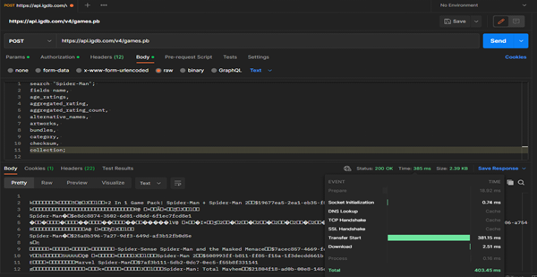
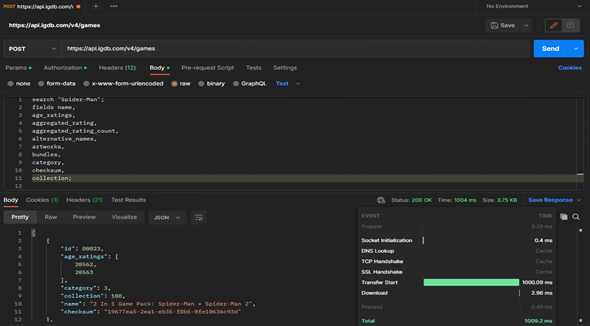

# Performance Monitoring of the IGDB API (RESTful vs gRPC)

This college research project compares the performance of RESTful and gRPC API calls to the IGDB API provided by Twitch, focusing on retrieving video game data.
It is a very basic project for beginners to understand the difference between the RESTful and gRPC API calls and their network performance.

## Table of Contents
1. [Purpose](#purpose)
2. [Prerequisites](#prerequisites)
3. [Setup](#setup)
4. [Results](#results)
5. [Project Documentation](#project-documentation)

---

## Purpose

The goal of this project is to monitor and compare the performance of both API methods (RESTful and gRPC) in retrieving information about video games, such as cover images, URLs, and screenshots.

## Prerequisites

1. **Obtain API Credentials**: 
   - Visit the [IGDB API Documentation](https://api-docs.igdb.com/#getting-started) to sign up for an account and get your API credentials (Client ID and Access Token).
   - Carefully read through the documentation to understand the request parameters and how to authenticate your API calls.

2. **CORS Setup**:
   - The project uses a proxy server to handle CORS issues. You will need to visit [CORS-Anywhere Demo](https://cors-anywhere.herokuapp.com/corsdemo) and request temporary access to the demo server for API calls.

## Setup

1. Clone the repository to your local machine.
2. Replace API keys in `Source/js.js` with your own Twitch credentials.
3. Open and run the `html.html` file in your browser.

## Results

Below are the key screenshots showing the interface and the request types:

| Webpage Screenshot                  | gRPC Request Screenshot            | REST Request Screenshot            |
|-------------------------------------|------------------------------------|------------------------------------|
|  |  |  |
| _The homepage where users can search for games._ | _Example of a gRPC API request._ | _Example of a REST API request._ |

**Observation**:  
- gRPC API call time was **403.45ms**.  
- RESTful API call time was **1000.2ms**.

## Project Documentation

An official college documentation with respect to the entire project can be found [here](https://drive.google.com/file/d/1U82VPJ6dJvsW-pIZedshqFAuhgDY755g/view?usp=sharing).

This project is designed as a research study on the performance differences between REST and gRPC API calls for real-time video game data retrieval.
